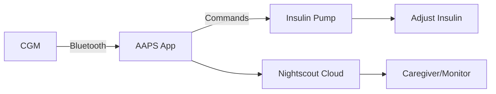

<!-- this is  on github server!
docs made by D.Galloway 2019- 2021-->

</a>

# **Intro into AAPS**  

!!! Question - what is AAPS
What is AAPS

!!! note "Info"

AAPS (Android Artificial Pancreas System) is a do-it-yourself (DIY), open-source automated insulin delivery (AID) system designed for people with Type 1 diabetes or insulin-dependent Type 2 diabetes. 

 It transforms an Android smartphone, a compatible insulin pump, and a CGM (Continuous Glucose Monitor) into a closed-loop system that automatically adjusts insulin delivery to keep blood glucose in range. 

!!! Question - what is AAPS
🔄 How Does AAPS Work? 

!!! note "Info"

1. Receives CGM Data (e.g., Dexcom G6, Libre 3)
• Continuously monitors glucose levels.
2. Predicts Future Glucose
• Uses the OpenAPS algorithm to forecast highs/lows.
3. Adjusts Insulin Automatically 
• Sends commands to your insulin pump (e.g., Omnipod DASH, Dana RS) to: 
• ⏫ Increase basal insulin if glucose is rising. 
• ⏬ Reduce/suspend insulin if glucose is dropping. 
• 💉 Give micro-boluses to correct highs. 
🔄 Updates every 5 minutes, 24/7 – mimicking a healthy pancreas! 
 

📋 Key Features  
✅ Open-source & free (no corporate lock-in). 
✅ Works offline (no internet required for looping). 
✅ Highly customizable (adjust targets, insulin sensitivity, etc.). 
✅ Supports multiple pumps & CGMs (unlike commercial systems). 
✅ Integrates with Nightscout (cloud monitoring for caregivers). 
 

!!! Warning "Important Considerations"

❗ Not FDA-approved – DIY project (use at your own risk). 
❗ Requires technical setup (must build the app yourself). 
❗ Medical supervision essential (always consult your doctor). 
❗ Backup plan needed (carry glucose & spare insulin). 
 

!!! note "What You Need to Use AAPS"

| Component    | Examples                         |
| ----------- | ------------------------------------ |
| `Android Phone`       | Android 9+ with Bluetooth   :material-check:      |
| `CGM`       | Dexcom G6/G7, Libre 2+/3+, Medtronic Guardian :material-check: |
| `Insulin PumpTE`    | Omnipod DASH, Dana RS/i, Accu-Chek Combo :material-check:  |
| `AAPS App APK`    | Self-built from <a href="https://github.com/nightscout/AndroidAPS" target="_blank"> Github</a> repo  |

 

!!! Tip "AAPS vs. Commercial Systems"

| Feature    | AAPS|Tandem Control-IQ / Omnipod 5|
| ----------- | ------------------------------|-------------|
| `Cost`       | Free        |££££ - Funded (pump + supplies)
|
| `Customization`       |Fully adjustable |Limited by FDA rules|
| `Pump Choice`    | Multiple options  |Brand-locked|
| `Approval`    | DIY (community-supported)  |FDA-approved|

 

!!! Note "🚀 Getting Started" 

1. Read the <a href="https://androidaps.readthedocs.io/en/latest/" target="_blank"> Official Docs</a>  – Understand the risks & requirements. This site Focuses on video setups rather than the Official Docs already made.
2. <a href="https://androidaps.readthedocs.io/en/latest/Getting-Started/CompatiblePumps.html" target="_blank"> Check Compatibility</a> – Ensure your devices work with AAPS.
3. Join Support Groups (Facebook: <a href="https://www.facebook.com/groups/androidapsusersuk" target="_blank"> "AndroidAPS Users UK"</a> -<a href="https://www.facebook.com/groups/AndroidAPSUsers" target="_blank"> "AndroidAPS Users"</a> - <a href="https://discord.com/invite/4fQUWHZ4Mw" target="_blank"> "Discord"</a> - <a href="https://www.facebook.com/groups/TheLoopedGroup" target="_blank"> "Looped"</a>. 
4. Build & Install – Follow the <a href="https://androidaps.readthedocs.io/en/latest/SettingUpAaps/BuildingAaps.html" target="_blank"> step-by-step guide</a>.

 

=== "🔄 AAPS in Action"

  

   

!!! Question  "FAQ"

Q: Is AAPS safe?
A: Many users report improved glucose control, but errors can happen – always monitor and have backup supplies. 

Q: Can I use an iPhone? 
A: No, AAPS is Android-only. iOS users can try Loop. 

Q: How hard is setup? 
A: Requires effort (~2-10 hours), but no coding knowledge is needed. 

Q: Will it prevent all hypos/hypers? 
A: No – it reduces extremes but isn’t perfect. User input (meals, exercise) still matters. 

  

!!! note "💡 Final Thoughts"
AAPS is a powerful, customizable alternative to commercial systems, but it demands technical effort, caution, and medical oversight. If you're comfortable with tech and want full control over your diabetes management, it could be life-changing!
  

 

[&emsp;&emsp;&emsp;&emsp;&emsp;&emsp;&emsp;&emsp;&emsp;]()
[Please Subscribe to our UTUBE Channel](https://www.youtube.com/channel/UC9TwtBefjjKw_uKHiIWMkBA?sub_confirmation=1){ .md-button }

 
<a href="https://maundyrelief.org.uk/" target="_blank">
  

</a>
 

 
Why Not take visit <a href="https://www.diabetes.org.uk/support-us/fundraise/fundraising-events/pedal-for-progress" target="_blank"> :man_biking_tone1: UK Wide Cycle Ride - Diabetes.uk :woman_biking_tone5:</a> **or** <a href="https://swim22.diabetes.org.uk/?fbclid=IwAR3XSygKTkbU7l_Xgu88WU3Q3EYFrFoAj1STvQTVz_6X-xthmjqOUWMTiww" target="_blank">Diabetes.UK Swim22 :man_swimming_tone5:</a> **or** <a href="https://www.diabetes.org.uk/support-us/fundraise/fundraising-events/60-miles-challenge" target="_blank">:man_walking_tone5: Diabetes UK Month of Miles Challenge :woman_running:</a> for all of your Diabetes Needs!

<!--  
  ******************************************************************************************************************
  mkdocs.yml    # The configuration file.
    docs/
    index.md  # The documentation homepage.
       ...       # Other markdown pages, images and other files.
		
		*************************************************************************
		center text**
		## 
Now Do  
 
		
		*************************************************************
		
		
		
		

Adding a Green Highlighter with Bold too:
**(Settings - Apps - xDrip+)**

adding 	Yellow Hightligher!!!!!!!!	with bold too
**Marked text**

	

link
<a href=" https://github.com/" target="_blank" title="First create a user account by going to">Click Here</a>

Adding a image with link
 

*******************		
external link
******************

# 
Part 4: <a href="https://atlas-night-out.github.io/xdrip-Nightscout-AAPS/user-guide/Fork_and_Deploy_cgm_remote_monitory_part4/" target="_blank" title="Fork and Deploy cgm remote monitory Part 4">Fork and Deploy cgm remote monitory</a> 

Adding Video

<iframe width="850" height="415" src="https://www.youtube.com/embed/MFsbm45b6YY" title="YouTube video player" frameborder="0" allow="accelerometer; autoplay; clipboard-write; encrypted-media; gyroscope; picture-in-picture" allowfullscreen></iframe>

Adding an embeded video
<iframe id="video3" width="560" height="315" src="https://www.youtube.com/embed/o7-T2IrDJ_A" title="YouTube video player" frameborder="0" allow="accelerometer; autoplay; clipboard-write; encrypted-media; gyroscope; picture-in-picture" allowfullscreen></iframe>

Note
**Note:** a note is something that needs to be mentioned but is apart from the context.

**Note:** a note is something that needs to be mentioned but is apart from the context.

This is a note with a drop down! you have to keep the format the same for it to work!!!!!!!!!!
??? info "Notes"

    Before proceeding, ensure that you've downloaded and installed all required applications on their respective devices. Once everything is set up, familiarize yourself with each app’s interface and functionality.   

!!! Warning "Important Notice - This Video is a Old Way Watch with Caution"

List
This is a regular paragraph.

Paragraph:

1. **Now Open another tab**  to make a Mongodb Atlas** Account: <a href="https://www.mongodb.com/cloud/atlas" target="_blank" title="Click Start Free">See Here</a> 
  and **click** Start Free
 
   2. Sub item two
   3. Sub item three
2. Item two

font size

link
<a href=" https://github.com/" target="_blank" title="First create a user account by going to">Click Here</a>

Table
| Syntax | Description |
| ----------- | ----------- |
| Header | Title |
| Paragraph | Text |

Video in a box border!

<table width="1166" border="1" style="border-color: #000000; background-color: #ffffff;" cellpadding="1" cellspacing="1" height="98">
<tbody>
<tr style="height: 16px;">
<td style="width: 1158px; border-color: #000000; background-color: #5B9BD5;" fff="">video Instructions,</td>
</tr>
<tr style="height: 56.4063px;">
<td style="width: 1158px; border-color: #000000;">
 <iframe id="video3" width="860" height="515" src="https://www.youtube.com/embed/6o3AdkQBVog" title="YouTube video player" frameborder="0" allow="accelerometer; autoplay; clipboard-write; encrypted-media; gyroscope; picture-in-picture" allowfullscreen></iframe>  </td>
</tr>
</tbody>
</table>
*****************************************************
Warning Note<table width="1266" border="1" style="border-color: #000000; background-color: #ffffff;" cellpadding="1" cellspacing="1" height="98">
<tbody>
<tr style="height: 16px;">
<td style="width: 1158px; border-color: #000000; background-color: #FF0000;" fff=""><strong>Warning!</strong></td>
</tr>
<tr style="height: 56.4063px;">
<td style="width: 1158px; border-color: #000000;"> 1: Some new features, updates, or bug fixes may require that you clear your browser cache before you will see the changes taken effect  2: If you get no errors and no readings after a while see about doing a <a href="http://127.0.0.1:8000/user-guide/Redeploying%20your%20repository/" target="_blank" title="Redeploying your repository link">Redeploying your repository</a> </td>
</tr>
</tbody>
</table>

Adding white space:

&emsp;&emsp;&emsp;&emsp;&emsp;&emsp;&emsp;&emsp;&nbsp;&nbsp;&nbsp;&nbsp;&nbsp;&nbsp;&nbsp;&nbsp;&nbsp;&nbsp;**Gear** &emsp;&emsp;&emsp;&emsp;&emsp;&emsp;&emsp;&emsp;&emsp;&emsp;&emsp;&emsp;&nbsp;&nbsp;&nbsp;&nbsp;&nbsp;&nbsp;&nbsp;&nbsp;&nbsp;&nbsp;&nbsp;&nbsp;&nbsp;&nbsp;&nbsp;**Settings**

-->

