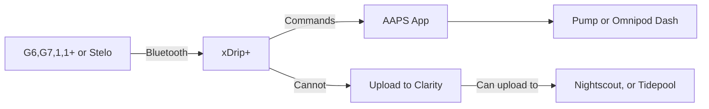
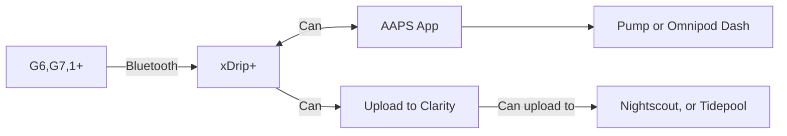

<!-- this is not on github server its local only and run my mkdocs server!
docs made by Tunasalad 2019- 2021-->
</a>
 

### [Xdrip+ Settings](Settings.md#settings)
### [xdrip± Specifications](Settings.md#specifications)
### [xdrip± Hardware Data Source](Settings.md#6-xdrip--hardware-data-source) 

</a> If you don't see this on installing! 

This is where you will be selecting your Hardware Data Source to work with xdrip.   

!!! note "Note"

 
In xDrip+, the Hardware Data Source is the setting that determines where your glucose data comes from. Here are the common options available, depending on your setup: 

I mostly Use Dexcom G7/G6/1/1+ (Transmitter) when I'm using a Dexcom One and Companion App for when I'm using the Dexcom G6  both of these options work in AAPS and my Galaxy Watch 7. 

To get to the settiings for it, by going to :material-menu: hamberger Menu > **Settings** > **Hardware Data Source** 

 

</a> 

 

You will need to pick a Hardware Data source to add into xDrip for your CGM to get readings. Take a look below to see  what might suit you on your setup you have, and then follow on from on from [Start Source Setup Wizard](#start-source-setup-wizard) below 

### Common Hardware Data Sources 

1. Dexcom G6/G7/1/1+ (Transmitter) 
&emsp;&emsp; :octicons-dot-fill-16:  Directly connects to Dexcom G6/G7/1/1+  transmitters via Bluetooth (no need for a separate receiver). 
&emsp;&emsp; :octicons-dot-fill-16:  Requires the official Dexcom transmitter or compatible third-party solutions. 

2. Libre Sensors (via Bluetooth Bridge) 
&emsp;&emsp; :octicons-dot-fill-16:	Libre 1 (14-day): Requires a Bluetooth bridge like BlueReader, MiaoMiao, or Bubble. 
&emsp;&emsp; :octicons-dot-fill-16:  Libre 2 (EU/US): Can work directly via Bluetooth (no bridge needed in some regions). 
&emsp;&emsp; :octicons-dot-fill-16:  Libre 3: Fully Bluetooth-enabled (direct connection to xDrip+ in some versions). 

3. Nightscout (as a Web Source)
&emsp;&emsp; :octicons-dot-fill-16:  Fetches data from a Nightscout site (if another device is uploading data there). 

4. Dexcom Share (for Follower) 
&emsp;&emsp; :octicons-dot-fill-16:  Pulls data from Dexcom's cloud servers (if using Dexcom Share with a receiver or phone app). 

5. Companion App 
&emsp;&emsp; :octicons-dot-fill-16:  G6/G7 (master only) apps. 
&emsp;&emsp; :octicons-dot-fill-16:  CamAPS app  
&emsp;&emsp; :octicons-dot-fill-16:  Omnipod 5 app  
&emsp;&emsp; :octicons-dot-fill-16:  Eversense apps  

 

### **G7,G6,Dex1,1+ and Stelo**  

If you connect xDrip+ directly to your sensor (G7, G6, 1, 1+, and Stelo), you will lose access to the suppliers app and Clarity uploads. However, you can use Nightscout or Tidepool. 

Sharing via share servers may still work if set up initially with supplier’s apps, I don’t think Dexcom One has a Sharing App, but Nightscout could still be used.

</a> 

=== "🔄 G7, G6, 1, 1+ or Stelo"

 

### **G6, G7, 1+**  
 
If you use the supplier’s (G6, G7, 1+), you can connect xDrip+ as a Share follower as long as a follower has been setup with the supplier’s (vendor). You can do this, by setting up [Dex Share Follower](../Dexcom/Dex%20Share%20Followers.md) and setting up a  Dexcom G6 App (Share)

But to use a Dexcom One you will need to use Nightscout. 

</a> 

=== "🔄 G7, G6, 1+ "

 

### **G6 only**  

When using BYODA (G6 only) if you've enabled Broadcast to xDrip+ you don't need a network connection to have data in xDrip+. Use the 640G/Eversense data source
 
 

## **Start Source Setup Wizard**

You will need to go to choose your Data Source, for your setup.
And to add this you should have a Start Source Setup Wizard on your main screen at the bottom of your screen from when you installed xDrip+ or  

 Go to your  :material-menu: Gear at top left! > Settings > Hardware Data Source 

</a>

 

If you do not have one of these at the bottom of your screen in xdrip+ you have two options one is to do a long press on the xdrip+ image at the top of your main screen :drop_of_blood: 

</a>

 

And turn on your Source Wizard Button. 

</a>

 
To be able to select you Data Source, but Like I said above, if you do not see yours then  

 Go to  :material-menu: Gear at top left > Settings > Hardware Data Source  

### ScreenCast Video: Example on how to add a Hardware Data Source

 
   

### UTUBE Video: Example on how to add a Hardware Data Source

  
   

 

You will see a long list of Hardware Data Source options to choose from.  

In this example I will be showing on how to add a Dexcom G6 with  using Companion App   

</a> &emsp;&emsp;</a>  
 

#### Make sure to Unpair your mobile

!!! Warning "Warning! Do not use your mobiles bluetooth connection"

Do not use your Mobiles auto Bluetooth connection to pair your Transmitter! If it does connect, unpair it from your phone first, before you begin to use xdrip+ has it will ask you to do it on its setup when adding Hardware Data Source! <a href="https://www.youtube.com/shorts/YVy_qxeHpog" target="_blank" title="Dexcom USA Account">See Here</a>  

 

Unpair if already connected. 

</a> &emsp;&emsp;</a></a>
 

!!! note "Info! &emsp;&emsp;  "

Sensors and Transmitters can only connect to one Mobile (or tablet) at a time, and only to one app at a time. There are ways around this, that will allow you to connect to other software packages like Android APS! 

I will not be going into that now though. 

 

#### Sensor Start Pairing Request:

You, should be getting Bluetooth Pairing request from when you Start your Sensor in xDrip+ unless you are using Companion App and then you will need to Start it from that vendors App. 

In my case Dexcom G6 App, </a> but I have a Dexcom Receiver too, so I use that instead of within the Dexcom G6 mmol/L DXCM1 App </a>(Android). If you do  not already have it  
installed, <a href="https://play.google.com/store/apps/details?id=com.dexcom.follow.region1.mmol" target="_blank" title="Dexcom Follow mmol/L DXCM1">Click Here</a> 

</a>

 
[*Last modified now*](https://github.com/NightscoutFoundation/xDrip/releases)

 
 

 
[&emsp;&emsp;&emsp;&emsp;&emsp;&emsp;&emsp;&emsp;&emsp;]()
[Please Subscribe to our UTUBE Channel](https://www.youtube.com/channel/UC9TwtBefjjKw_uKHiIWMkBA?sub_confirmation=1){ .md-button }

 
<a href="https://maundyrelief.org.uk/" target="_blank">
  

</a>
 

 
Why Not take visit <a href="https://www.diabetes.org.uk/support-us/fundraise/fundraising-events/pedal-for-progress" target="_blank"> :man_biking_tone1: UK Wide Cycle Ride - Diabetes.uk :woman_biking_tone5:</a> **or** <a href="https://swim22.diabetes.org.uk/?fbclid=IwAR3XSygKTkbU7l_Xgu88WU3Q3EYFrFoAj1STvQTVz_6X-xthmjqOUWMTiww" target="_blank">Diabetes.UK Swim22 :man_swimming_tone5:</a> **or** <a href="https://www.diabetes.org.uk/support-us/fundraise/fundraising-events/60-miles-challenge" target="_blank">:man_walking_tone5: Diabetes UK Month of Miles Challenge :woman_running:</a> for all of your Diabetes Needs!

<!--  
  ******************************************************************************************************************
  mkdocs.yml    # The configuration file.
    docs/
    index.md  # The documentation homepage.
       ...       # Other markdown pages, images and other files.
		
		*************************************************************************
		center text**
		## 
Now Do  
 
		
		*************************************************************
		
		
		
		
		
adding 	Green Hightligher!!!!!!!!	with bold too
**Choose Device**

adding 	Yellow Hightligher!!!!!!!!	with bold too
**Marked text**

	

white space:

&emsp;&emsp;&emsp;&emsp;&emsp;&emsp;&emsp;&emsp;&nbsp;&nbsp;&nbsp;&nbsp;&nbsp;&nbsp;&nbsp;&nbsp;&nbsp;&nbsp;

link
<a href=" https://github.com/" target="_blank" title="First create a user account by going to">Click Here</a>

Adding a image with link
 

Adding Video

<iframe width="850" height="415" src="https://www.youtube.com/embed/MFsbm45b6YY" title="YouTube video player" frameborder="0" allow="accelerometer; autoplay; clipboard-write; encrypted-media; gyroscope; picture-in-picture" allowfullscreen></iframe>

Adding an embeded video
<iframe id="video3" width="560" height="315" src="https://www.youtube.com/embed/o7-T2IrDJ_A" title="YouTube video player" frameborder="0" allow="accelerometer; autoplay; clipboard-write; encrypted-media; gyroscope; picture-in-picture" allowfullscreen></iframe>

Note
**Note:** a note is something that needs to be mentioned but is apart from the context.

This is a note with a drop down! you have to keep the format the same for it to work!!!!!!!!!!
??? info "Notes"

    Before proceeding, ensure that you've downloaded and installed all required applications on their respective devices. Once everything is set up, familiarize yourself with each app’s interface and functionality.   

???+ note "Note"       dropdown!

!!! note "Note"         normal!

!!! Warning "Important Notice - This Video is a Old Way Watch with Caution"

*****************************************
white space:

&emsp;&emsp;&emsp;&emsp;&emsp;&emsp;&emsp;&emsp;&nbsp;&nbsp;&nbsp;&nbsp;&nbsp;&nbsp;&nbsp;&nbsp;&nbsp;&nbsp;

List
This is a regular paragraph.

Paragraph:

1. **Now Open another tab**  to make a Mongodb Atlas** Account: <a href="https://www.mongodb.com/cloud/atlas" target="_blank" title="Click Start Free">See Here</a> 
  and **click** Start Free
 
   2. Sub item two
   3. Sub item three
2. Item two

Big Header:

# **Install xDrip+**  

font size

link
<a href=" https://github.com/" target="_blank" title="First create a user account by going to">Click Here</a>

Table
| Syntax | Description |
| ----------- | ----------- |
| Header | Title |
| Paragraph | Text |

Video in a box border!

<table width="1166" border="1" style="border-color: #000000; background-color: #ffffff;" cellpadding="1" cellspacing="1" height="98">
<tbody>
<tr style="height: 16px;">
<td style="width: 1158px; border-color: #000000; background-color: #5B9BD5;" fff="">video Instructions,</td>
</tr>
<tr style="height: 56.4063px;">
<td style="width: 1158px; border-color: #000000;">
 <iframe id="video3" width="860" height="515" src="https://www.youtube.com/embed/6o3AdkQBVog" title="YouTube video player" frameborder="0" allow="accelerometer; autoplay; clipboard-write; encrypted-media; gyroscope; picture-in-picture" allowfullscreen></iframe>  </td>
</tr>
</tbody>
</table>
*****************************************************
Warning Note<table width="1266" border="1" style="border-color: #000000; background-color: #ffffff;" cellpadding="1" cellspacing="1" height="98">
<tbody>
<tr style="height: 16px;">
<td style="width: 1158px; border-color: #000000; background-color: #FF0000;" fff=""><strong>Warning!</strong></td>
</tr>
<tr style="height: 56.4063px;">
<td style="width: 1158px; border-color: #000000;"> 1: Some new features, updates, or bug fixes may require that you clear your browser cache before you will see the changes taken effect  2: If you get no errors and no readings after a while see about doing a <a href="http://127.0.0.1:8000/user-guide/Redeploying%20your%20repository/" target="_blank" title="Redeploying your repository link">Redeploying your repository</a> </td>
</tr>
</tbody>
</table>

-->